# Полный отчет по ТЗ: RabbitMQ vs Redis (прогон `20260421_230330`)

## 1. Цель и формат эксперимента

Цель практики: сравнить `RabbitMQ` и `Redis` в равных условиях по:
- пропускной способности;
- задержкам;
- устойчивости к росту payload;
- точке деградации single instance.

Стенд:
- `producer`/`consumer` реализованы в `benchmark.py`;
- брокеры запускаются через `docker-compose.yml`;
- сценарии оркестрируются `run_experiments.sh`;
- агрегация и сводка выполняются `aggregate_results.py`.

## 2. Проверка соответствия ТЗ

### 2.1 Равенство условий

- Одинаковый формат сообщений и единый генератор payload: да.
- Одинаковые сценарии для обоих брокеров: да.
- Одинаковые лимиты контейнеров: да (`cpus: 1.0`, `mem_limit: 1024m` у обоих).
- Одинаковая длительность и warm-up в парных сценариях: да.

### 2.2 Обязательные эксперименты

- Базовое сравнение (`128 B`, `1 KB`, `10 KB`, `100 KB` x `1000/5000/10000`): да.
- Влияние размера сообщения: да.
- Влияние интенсивности потока (stress): да.

### 2.3 Что измерено

Собрано все метрики из ТЗ:
- `messages/sec`;
- средняя задержка;
- `p95` задержка;
- успешно обработанные сообщения;
- потерянные сообщения;
- точка деградации.

Дополнительно собраны:
- `CPU`;
- `RAM`;
- `backlog`.

## 3. Объем выполненного прогона

По файлам результата:
- `raw.ndjson`: `180` строк (180 запусков сценариев);
- `results.csv`: `181` строк (1 header + 180 записей);
- `resource_stats.csv`: `2948` строк (1 header + 2947 сэмплов).

Это соответствует `3` повторам полного набора сценариев (`60` сценариев на один repeat).

## 4. Сводная таблица по ключевому срезу (`target_rps = 5000`, медианы)

| Payload | Broker | Throughput (msg/s) | Avg latency (ms) | p95 latency (ms) | Lost | Backlog | CPU avg (%) | RAM avg (MB) |
|---:|---|---:|---:|---:|---:|---:|---:|---:|
| 128 B | rabbitmq | 3268.90 | 11.159 | 65.942 | 0 | 0 | 68.237 | 141.371 |
| 128 B | redis | 4667.77 | 2.230 | 3.572 | 0 | 0 | 35.773 | 27.568 |
| 1024 B | rabbitmq | 2269.63 | 6.913 | 53.569 | 0 | 0 | 53.045 | 150.586 |
| 1024 B | redis | 3099.80 | 3.525 | 6.029 | 0 | 0 | 29.122 | 100.648 |
| 10240 B | rabbitmq | 751.80 | 5.531 | 19.814 | 0 | 0 | 27.129 | 117.133 |
| 10240 B | redis | 762.83 | 4.341 | 6.850 | 0 | 0 | 15.216 | 205.096 |
| 102400 B | rabbitmq | 103.70 | 7090.975 | 11455.446 | 0 | 0 | 14.235 | 201.188 |
| 102400 B | redis | 100.20 | 20.703 | 30.184 | 0 | 0 | 17.188 | 194.486 |

## 5. Сравнение по всем критериям

### 5.1 Пропускная способность

На `target_rps=5000`:
- `128 B`, `1 KB`: выигрывает Redis.
- `10 KB`: Redis немного выше.
- `100 KB`: RabbitMQ немного выше.

По максимуму throughput в стресс-сценариях:
- `128 B`: RabbitMQ `3268.9`, Redis `4682.53` -> Redis лучше.
- `1 KB`: RabbitMQ `2357.55`, Redis `3420.85` -> Redis лучше.
- `10 KB`: RabbitMQ `758.83`, Redis `765.87` -> Redis немного лучше.
- `100 KB`: RabbitMQ `105.05`, Redis `102.25` -> RabbitMQ немного лучше.

### 5.2 Задержки

- По `p95` Redis лучше на всех payload.
- На `100 KB` у RabbitMQ наблюдается резкий рост хвоста задержек (`p95` ~ `11.5s`), тогда как у Redis `p95` ~ `30ms`.
- Средняя задержка подтверждает ту же картину: на `100 KB` у RabbitMQ `avg` ~ `7091ms`, у Redis `avg` ~ `20.7ms`.

### 5.3 Потери и backlog

- Потерянные сообщения: `0` для обоих брокеров во всех ключевых сценариях.
- Медианный backlog в итоговых сценариях: `0`.

### 5.4 CPU и RAM

- На малых payload RabbitMQ заметно более CPU-интенсивен, Redis экономичнее по CPU.
- На `10 KB` Redis использует больше RAM, но держит более низкий p95.
- На `100 KB` RAM у брокеров сопоставима, но поведение по latency принципиально разное (Redis существенно стабильнее).

## 6. Точка деградации

Из `degradation_points.csv`:
- RabbitMQ: устойчивая деградация фиксируется на `100 KB`, `1000 RPS`, `p95=10145.937 ms`, `6/6` деградировавших повторов.
- Redis: устойчивая деградация в текущем диапазоне нагрузок не зафиксирована.

## 7. Ответы на пункты ТЗ (готово для защиты)

1. Какой брокер показал большую пропускную способность:
- Redis лидирует на малых/средних payload (`128 B`, `1 KB`, `10 KB`),
- RabbitMQ слегка лучше на `100 KB` по throughput.

2. Какой брокер лучше переносит увеличение размера сообщения:
- По throughput на `100 KB` оба близки,
- По latency Redis переносит рост payload значительно лучше (особенно в хвостах задержек).

3. При какой нагрузке single instance начинает деградировать:
- RabbitMQ: `100 KB @ 1000 RPS` (устойчивая деградация),
- Redis: в тестовом диапазоне не достиг устойчивой деградации.

4. Какой инструмент лучше подходит и почему:
- В рамках этой практики лучше собственный Python-стенд (`benchmark.py` + `run_experiments.sh` + `aggregate_results.py`),
- потому что он обеспечивает единые условия, одинаковую методику, повторы, автоматический сбор CPU/RAM и воспроизводимую агрегацию.

## 8. Интегрированный визуальный анализ (таблицы + графики)

Используемые источники:
- `summary_by_scenario.csv` — медианные значения по каждому сценарию `(broker, payload, rps)`;
- `degradation_points.csv` — первый сценарий устойчивой деградации;
- `charts/*.png` — графики сравнения.

### 8.1 Графики throughput vs RPS

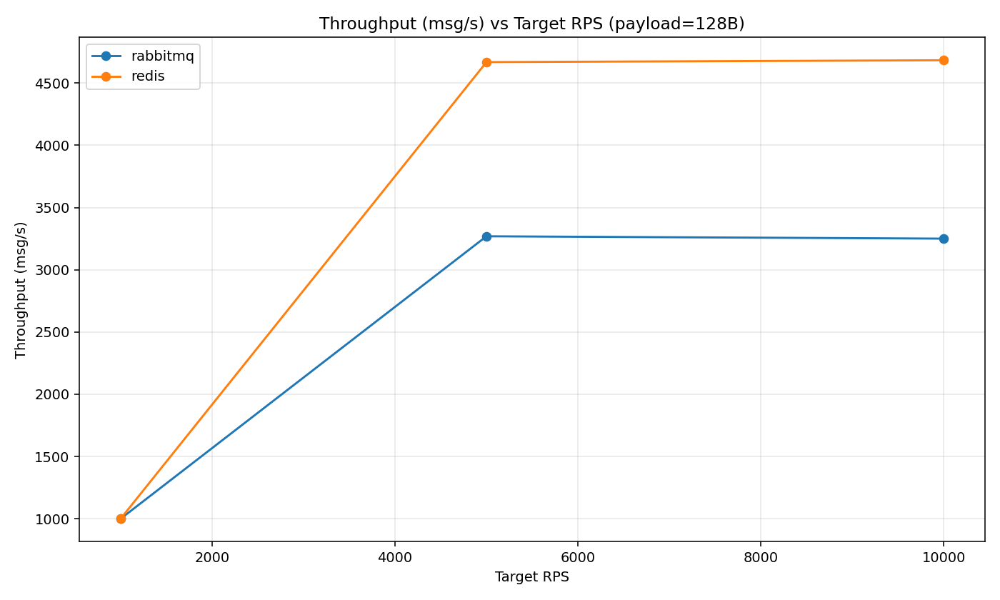

Вывод по графику `throughput_vs_rps_128B.png`:
- Redis стабильно выше RabbitMQ по всему диапазону RPS, разрыв значительный.

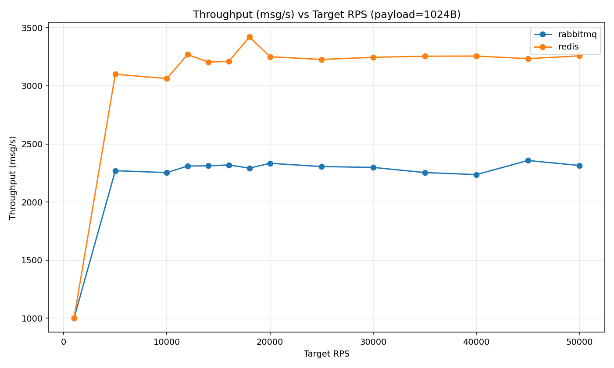

Вывод по графику `throughput_vs_rps_1024B.png`:
- Redis сохраняет лидерство по пропускной способности во всех точках нагрузки.

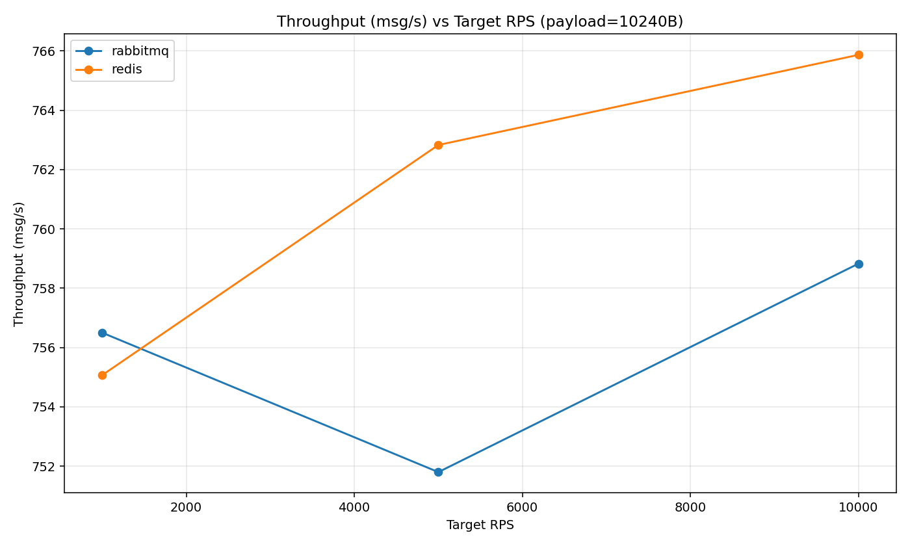

Вывод по графику `throughput_vs_rps_10240B.png`:
- На `10 KB` кривые близки, Redis чуть выше в большинстве точек.

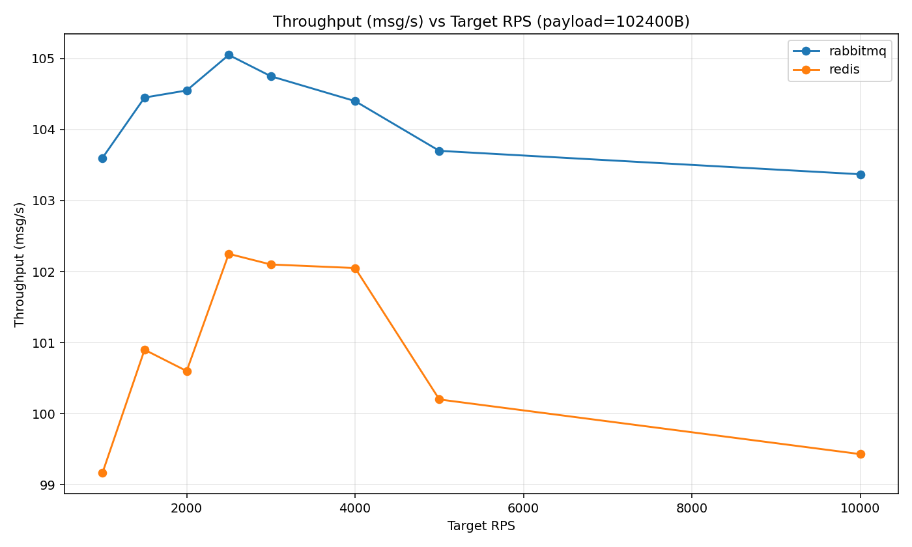

Вывод по графику `throughput_vs_rps_102400B.png`:
- На `100 KB` RabbitMQ немного опережает Redis по throughput, но отрыв небольшой.

### 8.2 Графики p95 latency vs RPS

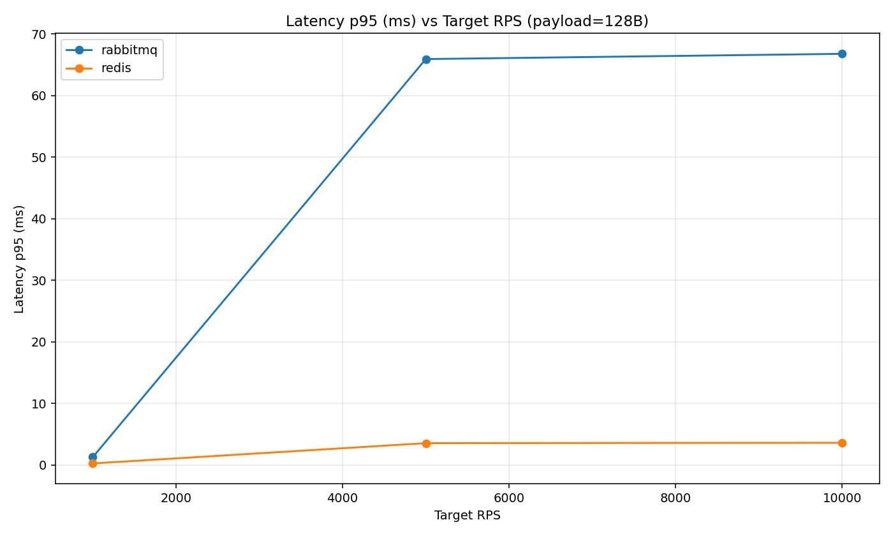

Вывод по графику `latency_p95_vs_rps_128B.png`:
- Redis держит заметно более низкий p95 по всему диапазону нагрузки.

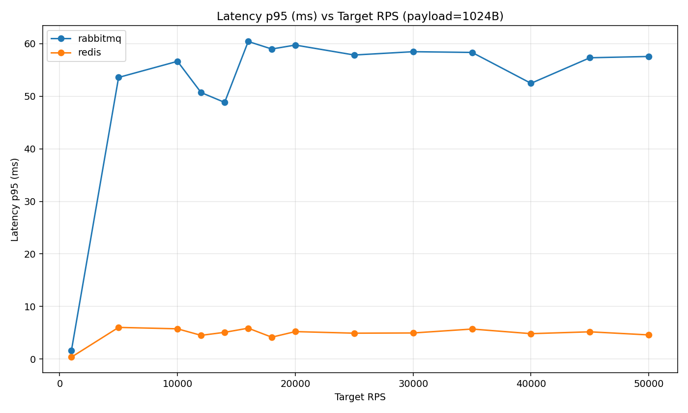

Вывод по графику `latency_p95_vs_rps_1024B.png`:
- Картина сохраняется: Redis существенно лучше по хвостам задержек.

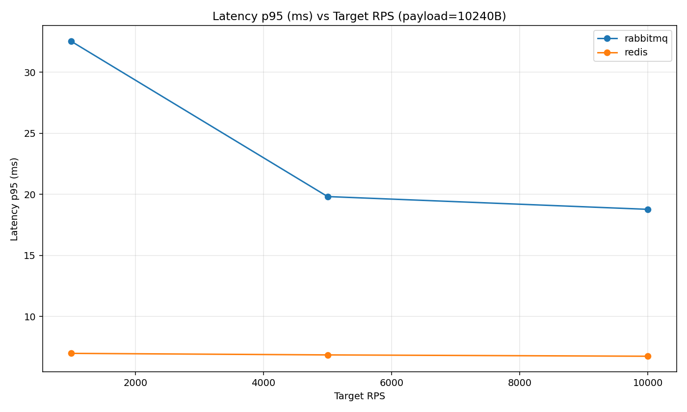

Вывод по графику `latency_p95_vs_rps_10240B.png`:
- На `10 KB` разница сохраняется, Redis стабильно ниже по p95.

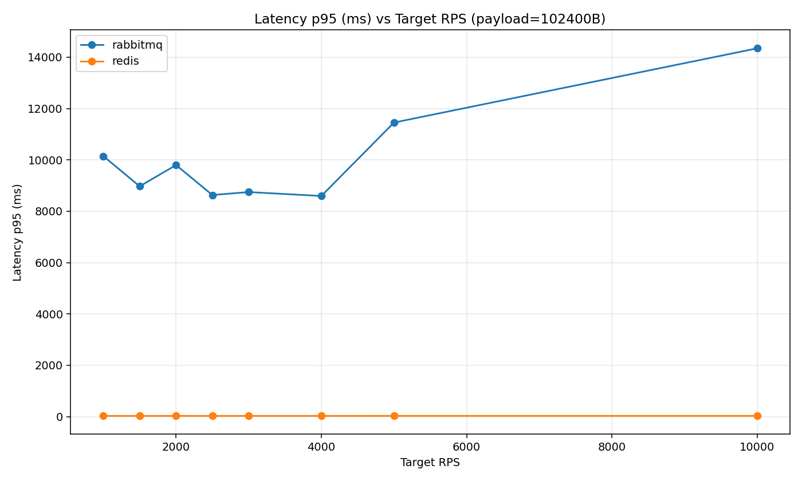

Вывод по графику `latency_p95_vs_rps_102400B.png`:
- На `100 KB` p95 у RabbitMQ резко возрастает (секунды), у Redis остается на уровне десятков миллисекунд.

### 8.3 Графики CPU avg vs RPS

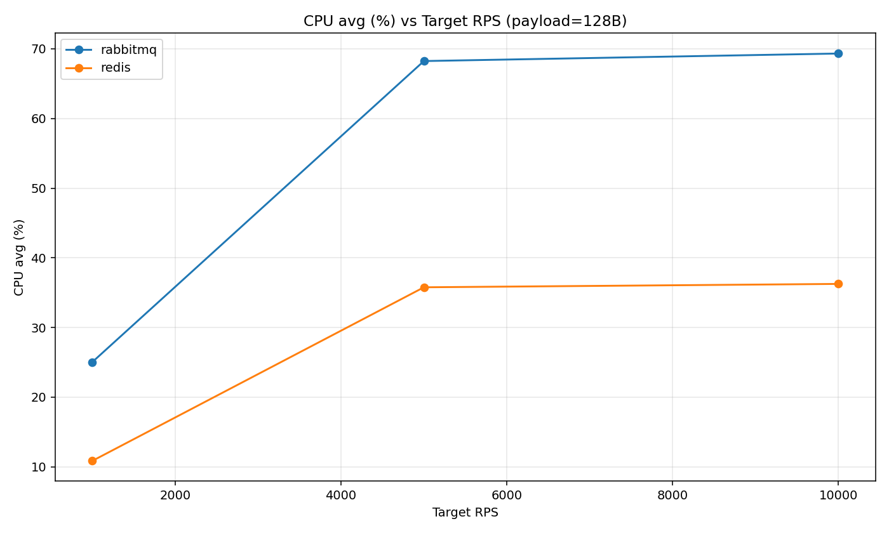

Вывод по графику `cpu_avg_vs_rps_128B.png`:
- RabbitMQ потребляет больше CPU, чем Redis, особенно на высоких RPS.

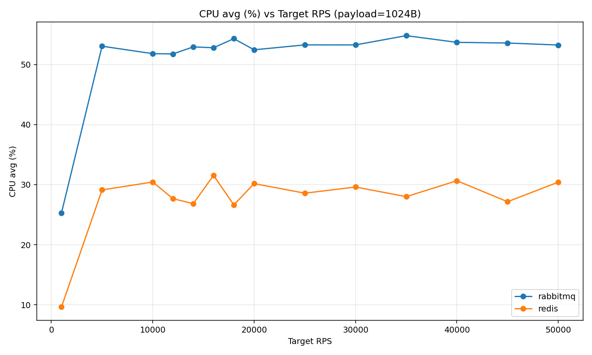

Вывод по графику `cpu_avg_vs_rps_1024B.png`:
- Тот же тренд: RabbitMQ CPU-heavy, Redis CPU-эффективнее.

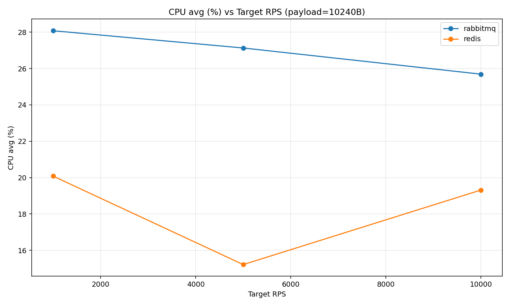

Вывод по графику `cpu_avg_vs_rps_10240B.png`:
- На `10 KB` обе кривые ниже, но RabbitMQ в среднем остается выше Redis по CPU.

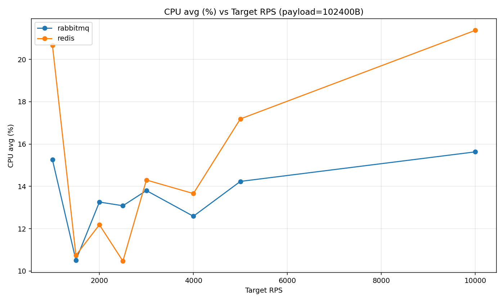

Вывод по графику `cpu_avg_vs_rps_102400B.png`:
- На `100 KB` средний CPU сопоставим, локально Redis может быть выше, но это не приводит к росту p95 как у RabbitMQ.

### 8.4 Графики RAM avg vs RPS

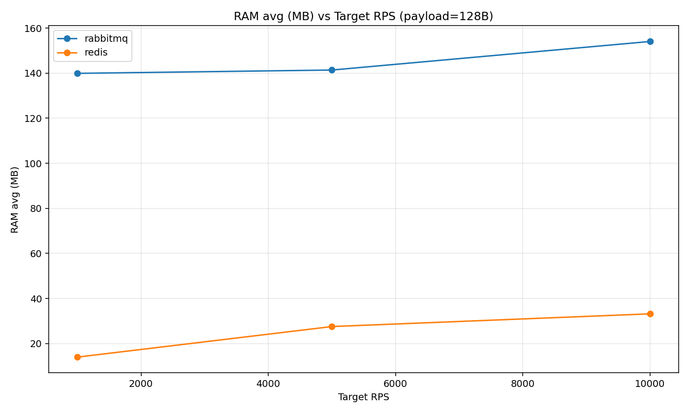

Вывод по графику `ram_avg_vs_rps_128B.png`:
- На малом payload Redis использует заметно меньше RAM.

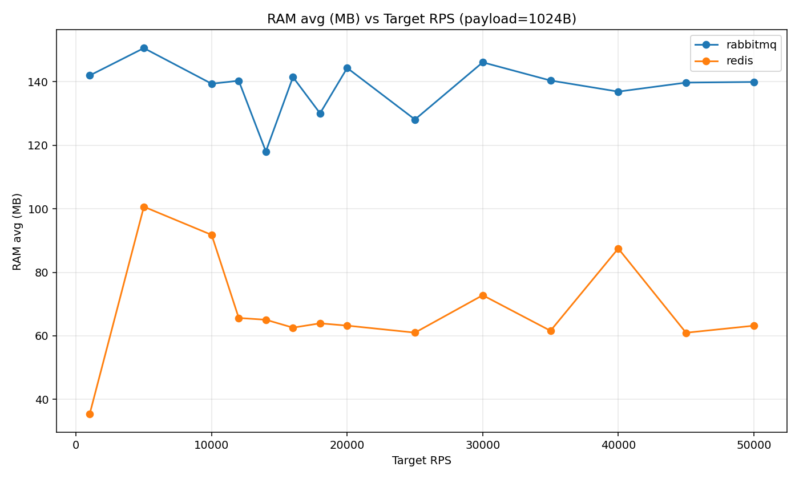

Вывод по графику `ram_avg_vs_rps_1024B.png`:
- Redis все еще экономичнее по памяти в среднем диапазоне размера сообщений.

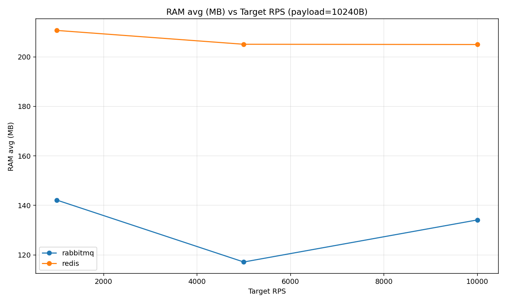

Вывод по графику `ram_avg_vs_rps_10240B.png`:
- На `10 KB` Redis начинает использовать больше RAM, чем RabbitMQ.

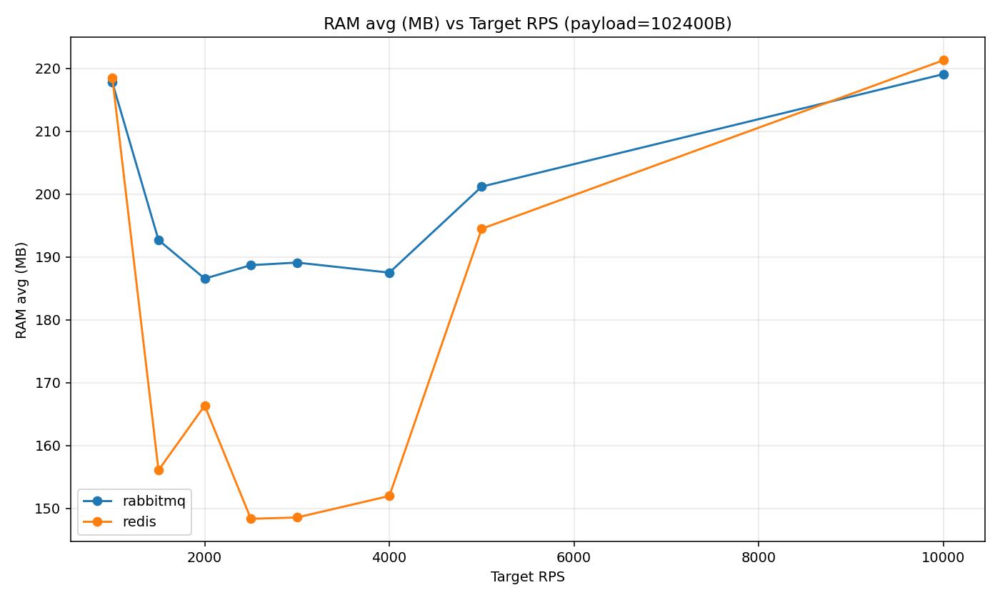

Вывод по графику `ram_avg_vs_rps_102400B.png`:
- На `100 KB` потребление RAM у брокеров близко, но Redis часто выше в пиках.

## 9. Почему Redis хуже на больших данных (и в чем именно хуже)

Важно: в текущем прогоне Redis хуже на больших payload в основном по **throughput** (не по latency).

Что видно по данным:
- На `100 KB` throughput у RabbitMQ немного выше (`103.70` vs `100.20` msg/s на срезе `5000 RPS`).
- При этом по задержкам Redis значительно лучше (`p95 30.184 ms` vs `11455.446 ms`).

Почему так происходит:
1. Redis Streams обрабатываются в одном event-loop потоке Redis.
  На крупных payload растет стоимость одной операции `XADD/XREADGROUP/XACK` по копированию и обслуживанию структуры stream.
2. Для больших сообщений увеличивается накладной расход на управление памятью и внутренние структуры Redis (entries, индексы, bookkeeping consumer group).
3. Redis настроен с `maxmemory` и `noeviction`.
  При приближении к лимитам он не вытесняет данные, а снижает способность принимать дополнительную запись быстро.
4. RabbitMQ в этой конфигурации может чуть лучше утилизировать конвейер доставки крупных transient-сообщений по throughput,
  но платит за это тяжелым хвостом задержек на больших payload.

Итог по интерпретации:
- Если критерий приоритета — максимальный throughput на очень крупном payload, RabbitMQ в этом прогоне чуть впереди.
- Если критерий приоритета — предсказуемые задержки и стабильный p95, Redis на больших payload заметно лучше.

## 10. Финальный вывод по прогону `20260421_230330`

1. Redis является общим победителем по совокупности метрик для `128 B`, `1 KB`, `10 KB`.
2. На `100 KB` RabbitMQ немного лучше по throughput, но резко хуже по latency.
3. Устойчивая деградация зафиксирована у RabbitMQ на `100 KB @ 1000 RPS` (`6/6` деградировавших повторов).
4. Для Redis в протестированном диапазоне устойчивая деградация не достигнута.
5. Для продакшн-выбора при интерактивных нагрузках и SLA по latency результат этого прогона явно в пользу Redis.
